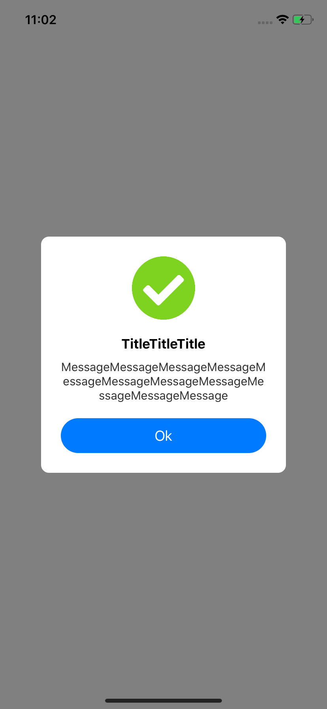
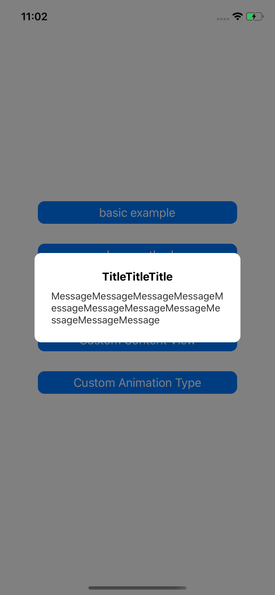
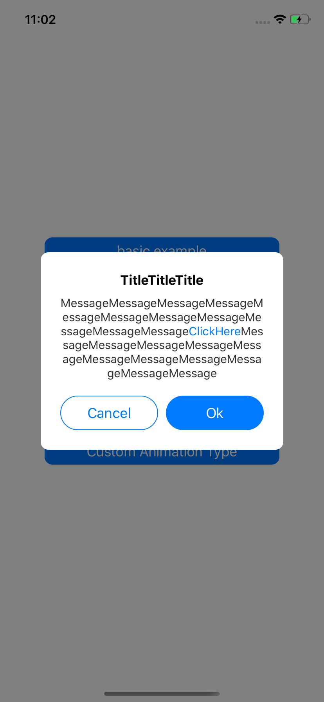
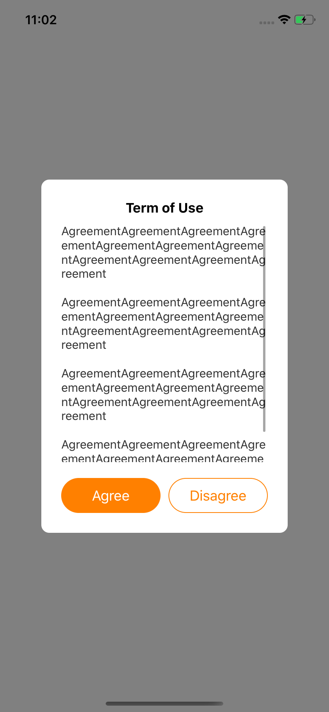
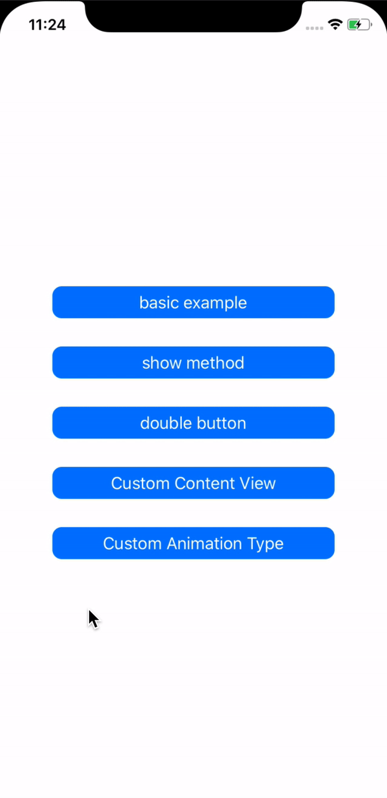
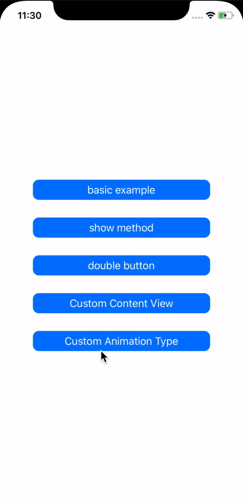

# BZPopupWindow


[](https://cocoapods.org/pods/BZPopupWindow)
[](https://cocoapods.org/pods/BZPopupWindow)
[](https://cocoapods.org/pods/BZPopupWindow)

# Introduction
BZPopupWindow a versatile, customizable and lightweight popup window written in Swift

## Features
- [x] Supports images, custom title and message, custom view, and custom animation
- [x] More appropriate UI design than the default UIAlterController

## Example

To run the example project, clone the repo, and run `pod install` from the Example directory first.

### 1. Default Image + Title + Message + Button
Just provide image (optional), title (optional), message (optional), action (optional). To show the popup window, we can use present method.
```Swift
let image = UIImage(named: "correct.png")
let title = "TitleTitleTitle"
let message = "MessageMessageMessageMessageMessageMessageMessageMessageMessageMessageMessage"
let popupWindow = BZPopupWindow(image: image, imageSize: CGSize(width: 80, height: 80), title: title, message: message)
let action = BZPopupAction(title: "Ok")
popupWindow.addAction(action)
present(popupWindow, animated: true, completion: nil)
```


### 2. Show Method
You can also use show method to show the popup window. You can also change the text aligment.
```Swift
let title = "TitleTitleTitle"
let message = "MessageMessageMessageMessageMessageMessageMessageMessageMessageMessageMessage"
let popupWindow = BZPopupWindow(title: title, message: message)
popupWindow.messageAligment = .left
popupWindow.show(completion: nil)
```


### 3. Double Button
This example creates double button in popup window. It also creates custom title and message (attributed string). Also, it provides a completion handler to action2. What's more, there is a clickable link in the message.
```Swift
let title = "TitleTitleTitle"
let attributedTitle = NSAttributedString(string: title, attributes: [
    NSAttributedString.Key.font: UIFont.systemFont(ofSize: 17, weight: .bold),
    NSAttributedString.Key.foregroundColor: UIColor.black])

let message = "MessageMessageMessageMessageMessageMessageMessageMessageMessageMessageMessageClickHereMessageMessageMessageMessageMessageMessageMessageMessageMessageMessageMessage"
let attributedMessage: NSMutableAttributedString = NSMutableAttributedString(string: message)
let clickHereTange = (attributedMessage.string as NSString).range(of: "ClickHere")
attributedMessage.addAttribute(NSAttributedString.Key.link, value: "https://github.com/", range: clickHereTange)
attributedMessage.addAttributes([
    NSAttributedString.Key.font: UIFont.systemFont(ofSize: 15),
    NSAttributedString.Key.foregroundColor: UIColor(red: 51/255, green: 51/255, blue: 51/255, alpha: 1)]
, range: NSRange(location: 0, length: attributedMessage.string.count))

let popupWindow = BZPopupWindow(title: attributedTitle, message: attributedMessage)
let action1 = BZPopupAction(title: "Cancel", style: .cancel)
let action2 = BZPopupAction(title: "Ok") {
    print("Ok")
}
popupWindow.addAction(action1)
popupWindow.addAction(action2)
present(popupWindow, animated: true, completion: nil)
```


### 4. Custom View
This example creates a custom view in popup window. The custom view is a UIScrollView. This example can be used to show terms of use. Also, the color of button is customized.
```Swift
let customView = UIScrollView()
customView.snp.makeConstraints { make in
    make.width.equalTo(260)
    make.height.equalTo(300)
}

let messageLabel = UILabel(frame: .zero)

customView.addSubview(messageLabel)

messageLabel.text = "AgreementAgreementAgreementAgreementAgreementAgreementAgreementAgreementAgreementAgreementAgreement\n\nAgreementAgreementAgreementAgreementAgreementAgreementAgreementAgreementAgreementAgreementAgreement\n\nAgreementAgreementAgreementAgreementAgreementAgreementAgreementAgreementAgreementAgreementAgreement\n\nAgreementAgreementAgreementAgreementAgreementAgreementAgreementAgreementAgreementAgreementAgreement"
messageLabel.textAlignment = .left
messageLabel.font = UIFont.systemFont(ofSize: 15)
messageLabel.numberOfLines = 0
messageLabel.lineBreakMode = .byWordWrapping
messageLabel.textColor = UIColor(red: 51/255, green: 51/255, blue: 51/255, alpha: 1)
messageLabel.snp.makeConstraints { make in
    make.top.equalTo(customView.snp.top)
    make.width.equalTo(260)
    make.bottom.equalToSuperview()
    make.centerX.equalToSuperview()
}

let popupWindow = BZPopupWindow(title: "Term of Use", customContentView: customView)

let action1 = BZPopupAction(title: "Agree", color: .orange)
let action2 = BZPopupAction(title: "Disagree", color: .orange, style: .cancel)

popupWindow.addAction(action1)
popupWindow.addAction(action2)
popupWindow.show(completion: nil)
```


### 5. Custom Animation
The left hand side is default animation. The right hand side is transition from bottom animation.
```Swift
let title = "TitTitleTitle"
let message = "AnimationFromBottomAnimationFromBottomAnimationFromBottomAnimationFromBottomAnimationFromBottomAnimationFromBottomAnimationFromBottomAnimationFromBottomAnimationFromBottomAnimationFromBottomAnimationFromBottomAnimationFromBottomAnimationFromBottomAnimationFromBottomAnimation"
let popupWindow = BZPopupWindow(image: nil, imageSize: CGSize(width: 60, height: 60), title: title, message: message)
let action = BZPopupAction(title: "Ok")
popupWindow.addAction(action)
//        popupWindow.show(completion: nil) // default animation
popupWindow.show(animationType: .bottom, completion: nil) // transition from bottom
```
<p float="left">
  
  
</p>


## Requirements
This version requires iOS 10.0+ and Swift 5.

## Installation

BZPopupWindow is available through [CocoaPods](https://cocoapods.org). To install
it, simply add the following line to your Podfile:

```ruby
pod 'BZPopupWindow'
```

## Author

banghuazhao, banghua.zhao@gmail.com

## License

BZPopupWindow is available under the MIT license. See the LICENSE file for more info.
